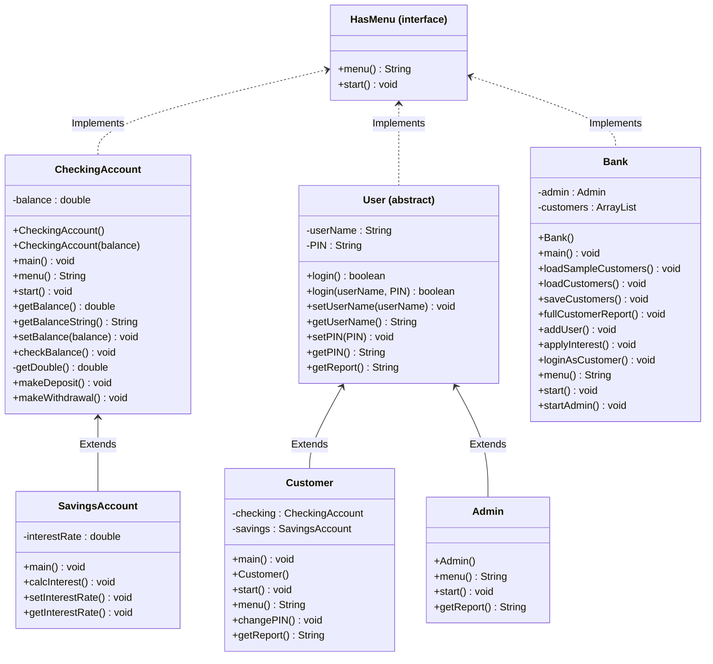

# CS121-Bank-on-it-Part-II-Project
## UML Class Diagram

```mermaid
classDiagram

class HasMenu["HasMenu (interface)"] {
    +menu() String
    +start() void
}

class CheckingAccount {
    -balance : double
    +CheckingAccount()
    +CheckingAccount(balance)
    +main() void
    +menu() String
    +start() void
    +getBalance() double
    +getBalanceString() String
    +setBalance(balance) void
    +checkBalance() void
    -getDouble() double
    +makeDeposit() void
    +makeWithdrawal() void
}

class SavingsAccount {
    -interestRate : double
    +main() void
    +calcInterest() void
    +setInterestRate() void
    +getInterestRate() void
}

class User["User (abstract)"] {
    -userName : String
    -PIN : String
    +login() boolean
    +login(userName, PIN) boolean
    +setUserName(userName) void
    +getUserName() String
    +setPIN(PIN) void
    +getPIN() String
    +getReport() String
}

class Customer {
    -checking : CheckingAccount
    -savings : SavingsAccount
    +main() void
    +Customer()
    +start() void
    +menu() String
    +changePIN() void
    +getReport() String
}

class Admin {
    +Admin()
    +menu() String
    +start() void
    +getReport() String
}

class Bank {
    -admin : Admin
    -customers : ArrayList
    +Bank()
    +main() void
    +loadSampleCustomers() void
    +loadCustomers() void
    +saveCustomers() void
    +fullCustomerReport() void
    +addUser() void
    +applyInterest() void
    +loginAsCustomer() void
    +menu() String
    +start() void
    +startAdmin() void
}

HasMenu <.. CheckingAccount : Implements
HasMenu <.. User : Implements
HasMenu <.. Bank : Implements

CheckingAccount <-- SavingsAccount : Extends
User <-- Customer : Extends
User <-- Admin : Extends
```
```

